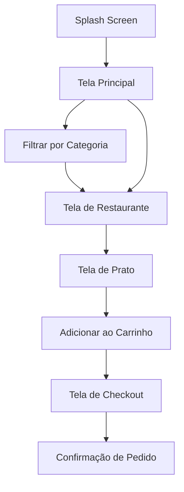
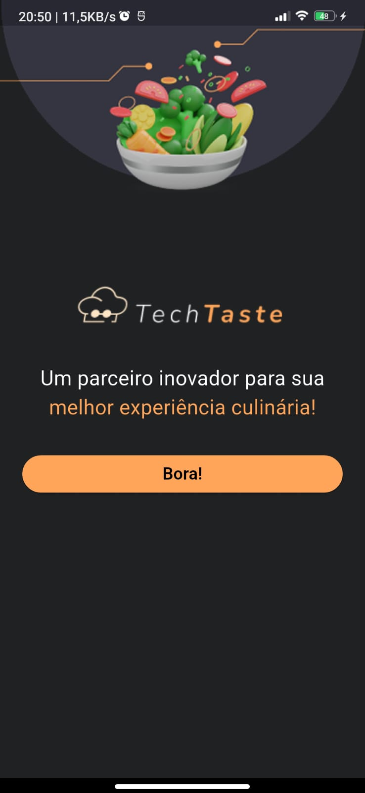

# techtaste

Aplicativo Flutter para explorar restaurantes, pratos e categorias gastronômicas.

## Instalação

1. Clone o repositório:
   ```powershell
   git clone https://github.com/seuusuario/techtaste.git
   ```
2. Instale as dependências:
   ```powershell
   flutter pub get
   ```
3. Execute o app:
   ```powershell
   flutter run
   ```

## Funcionalidades

- Listagem de restaurantes e pratos
- Filtros por categoria
- Tela de checkout
- Splash screen personalizada

## Estrutura do Projeto

- `lib/`: Código principal do app
  - `data/`: Dados estáticos
  - `model/`: Modelos de dados
  - `ui/`: Telas e componentes visuais

## Fluxo do Aplicativo



### Exemplos de Telas

<div align="center">
  <h2>Splash Screen</h2>
  

  <h2>Tela Principal</h2>
  

  <h2>Tela de Restaurante</h2>
  

  <h2>Tela de Prato</h2>
  

  <h2>Tela de Checkout</h2>
  

  <h2>Confirmação de Pedido</h2>
  
</div>

## Contribuição

Contribuições são bem-vindas! Abra uma issue ou envie um pull request.

## Licença

Este projeto está licenciado sob a licença MIT.

**Aviso:** As imagens dos pratos presentes neste repositório foram geradas por inteligência artificial (IA).
