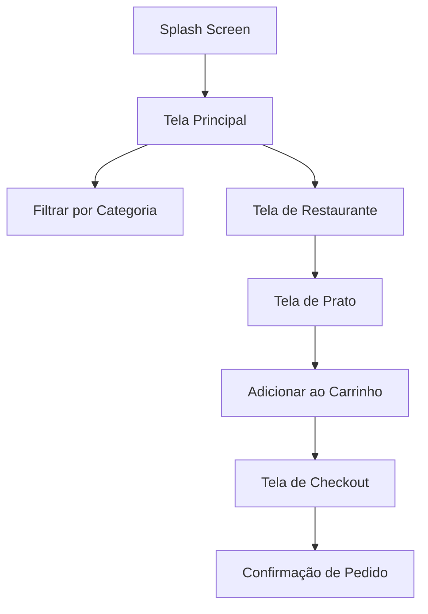
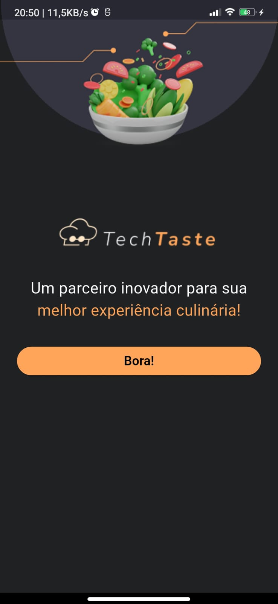
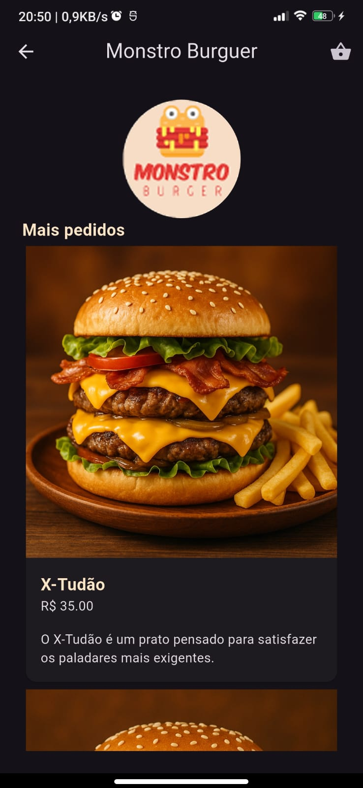
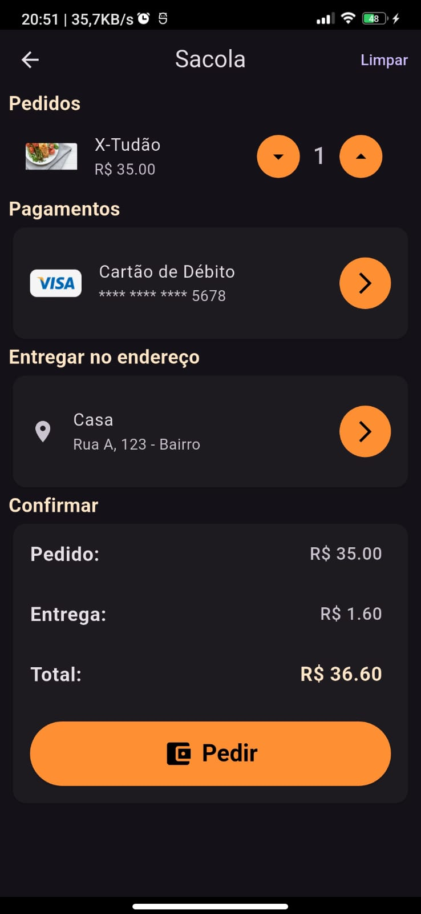
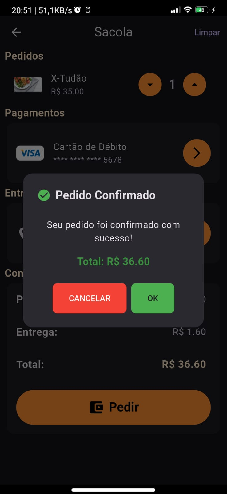

# techtaste

Aplicativo Flutter para explorar restaurantes, pratos e categorias gastronômicas.

## Instalação

1. Clone o repositório:
   ```powershell
   git clone https://github.com/seuusuario/techtaste.git
   ```
2. Instale as dependências:
   ```powershell
   flutter pub get
   ```
3. Execute o app:
   ```powershell
   flutter run
   ```

## Funcionalidades

- Listagem de restaurantes e pratos
- Filtros por categoria
- Tela de checkout
- Splash screen personalizada

## Estrutura do Projeto

- `lib/`: Código principal do app
  - `data/`: Dados estáticos
  - `model/`: Modelos de dados
  - `ui/`: Telas e componentes visuais

## Fluxo do Aplicativo



### Exemplos de Telas

**Splash Screen**


**Tela Principal**


**Tela de Restaurante**


**Tela de Prato**


**Tela de Checkout**


**Confirmação de Pedido**


## Contribuição

Contribuições são bem-vindas! Abra uma issue ou envie um pull request.

## Licença

Este projeto está licenciado sob a licença MIT.

**Aviso:** As imagens dos pratos presentes neste repositório foram geradas por inteligência artificial (IA).
